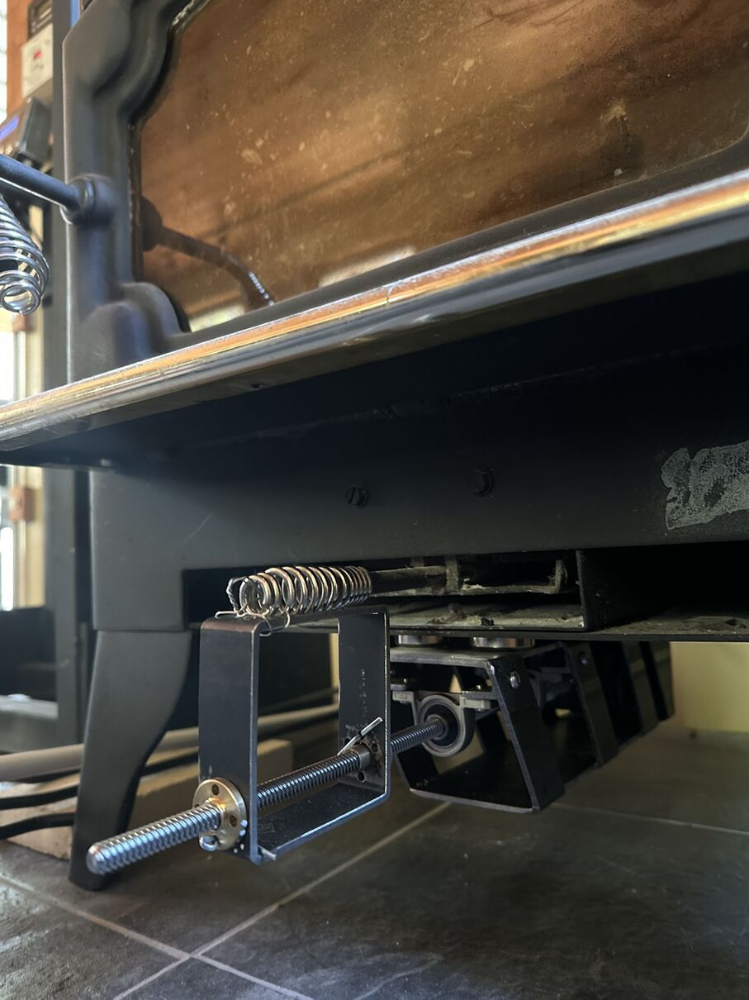

# Wood Stove Air Operator Robot 2





Wood, a renewable home heating fuel, is best IMO with a wood stove.

Add wood, open the air valve to get the burn going, close it down later for low slow coals.

After repeating this several times, I wondered if the air handling could be turned over to a robot.  

User story 1:  Wake up in the middle of the night, add wood to the wood stove, push a button, go back to sleep.  

User story 2:  Load wood in the wood stove, push a button, lie on the couch, don't get up for hours.

Here is version 2 of that button.

### Did you know that bimetallic strip mechanical versions of this device are available for many wood stoves.

Yes.

# The Algorithm

In July 2025, the WSR2 firmware is an untested draft.  WSR1 ran for one winter on the previous hardware revision.  Lockheed Martin is not even in the design phase of more experimental wood stove technology. 

WSR1 only closed the air valve.  I pushed a button or turned the knob to add air, shortly after adding wood.  

WSR2 has dual thermocouples for redundant signal, and will open and close the air valve.  Fully automatic air by 2026.

[wsr1/auto_burn.h](wsr1/auto_burn.h), [wsr2/auto_burn.h](wsr2/auto_burn.h).

# Globalization Hardware 

* MEGA 2560 PRO Embed CH340G/ATMEGA2560-16AU Pro Mega (Arduino clone)

* STEPPERONLINE Nema 17 Stepper Motor Bipolar 2A 59Ncm(84oz.in) 48mm Body 4-lead W/ 1m Cable and Connector 

* 550mm Tr8X8 Lead Screw with T8 Brass Nut for 3D Printer Machine Z Axis(Acme Thread, 2mm Pitch, 4 Start, 8mm Lead)

* Eowpower 4 Pieces 8 mm Bore Diameter Ball Mounted Pillow Block Insert Bearings

* BIGTREETECH TMC5160T Pro V1.0 Stepper Motor Drivers with Heatsink Ultra Silent Driver Support 56V 3A 

* BIGTREETECH TMC2209 V1.3 Stepper Motor Driver, UART/STEP/DIR Mode, Ultra Silent Stepsticks Drivers 

# Printed Circuit Boards are a fun union of logic and science and art 

[Kicad](https://www.kicad.org/) is a free, cross-platform, circuit board design tool.  It's great.  Donate.

[OSH Park](https://docs.oshpark.com/services/afterdark/) will take your Kicad file directly and mail back three copies of your printed circuit board that look cool, are easy to solder, and contain real gold.

# Local Fabrication

Woodstove Robots 1 and 2 are made from 1/8" thick hot rolled steel square tubing, from the scrap rack of the local industrial hardware and metals supplier.  WSR1 was made with angle grinders, a drill press, hand files, and stick welding.  WSR2 was made with angle grinders, a benchtop milling machine, hand files, and tig welding.  

Online sheet metal fabrication is surely competitive, if you are good at the software, if you have limited space or noise ordinance.

There are probably plastics for this application.  I pass, plastic doesn't seem like the spirit of a fire box.

# Arduino Setup

Thank you arduino-cli, paving the road of hobbyist firmware smooth.

```
# Access to /dev/ttyUSB0 and so forth
$ usermod -a -G dialout $USER
$ reboot

# Arduino Mega platform
$ arduino-cli config init
$ ls ~/.arduino15/
$ cat ~/.arduino15/arduino-cli.yaml
$ arduino-cli core update-index
$ arduino-cli core install arduino:megaavr

# Libraries 

# SunFounder IIC I2C TWI Serial 2004 20x4 LCD Module 
$ arduino-cli lib install "LiquidCrystal I2C"

# Adafruit Neopixel 
$ arduino-cli lib install "Adafruit NeoPixel"

# Interrupt based driver for rotary encoder 
$ arduino-cli lib install Encoder

# Timer interrupt library by for stepper steps 
$ arduino-cli lib install TimerInterrupt

# TMCStepper for 2209/5160/others
$ arduino-cli lib install TMCStepper

# How to get assembly listings, map files

$ apt install binutils-avr
$ ls /tmp/arduino/sketches/
$ cd /tmp/arduino/sketches/6789XYZW.../
$ avr-objdump -dS ./foo.ino.elf > listing.s
$ avr-objdump -tC foo.ino.elf | sort > mapfile

```

# Wood Stove Robot 1


## Improvements from Wood Stove Robot 1 to 2

*  Printed circuit board.
*  Trinamic quiet stepper driver.
*  Self calibrating via Trinamic Stallguard, eliminate load sensor.
*  Dual thermocouple for redundancy on the key performance indicator.
*  Ambient light sensor driving variable LCD backlight, my eyeballs at 3am.
*  Shielded cable for stepper motor.
*  Better housings/enclosures.
*  Screw terminal blocks for wiring, because a crimped JST-clone connector failed.

# Miscellaneous

## WSR2 PCB Rev 1 Improvements/Errata

*  PS vias should be sized like resistors.
*  Resistor vias should be sized like the PS vias.
*  Square pad is ground, because of the thermal vias?  I have backwards?  Remove on motor controller outputs.
*  Power and ground for lighted buttons?
*  12v - 5v converter pins are short on the long axis, measure with a breadboard.
*  TMC2209 serial wiring is wrong.  
*  The 4" square footprint PCB extended Mega is right.
*  Remove the extras?  Pick a motor controller?
*  Decoupling capacitor for the NeoPixels.

## Ideas for Wood Stove Robot 3

*  GaN power supply.  $70 at Digikey in 2025.
*  Add stovepipe exhaust damper, second stepper motor. 
*  Where do I get the stylish, well manufactured, aircraft grade buttons and knobs?  Where can I pick over that salvage?
*  Optical temperature pickup for entirely redundant sensor mechanisms.
*  Weld an entire new wood stove, Level 60 Cyborg Bullerjan Style, wielding an absurd heat distributing +10 surface area stovepipe, dual integrated ceiling cat warmer.
*  Pivot to masonry, stack rocks for da real thermal mass.

## Editorial Praise of Firewood

For forty years, I lived in a box with a thermostat and a fossil fuel burner with a control system on the fuel.  Heat distribution throughout the box.  The plumber is truly a magician.

Edwin Drake pumped oil in 1859.  In 2025, cheap combustion fuels flow through myriad control systems.  Homo sapiens have walked the earth for 300,000 years.  Wood stove prices are at historical lows.

When I put a good stick of firewood over my shoulder, my arm naturally wraps up around and balances it.  The weight of the stick transits comfortably down my spine into my all terrain feet.  To carry a bundle of smaller fuel, curl the arm down and back.  If Nature didn't build this thing to carry sticks through the forest, then it's only correlation.

Firewood warms you a bunch of times, promotes healthy interaction with the natural world, provides winter activity, and helps you sleep in at least two ways.

## A computer should never make a decision, because a computer cannot be held responsible.

Do I have product-market fit, yet?

Every wood stove is different.  The hardware must be reliable in the presence of heat and ash and dust and time and cat hair and kicking it by accident in the dark.

This robot may improve your wood stove experience and you'll love it.  It will replace part of you with automation.  If it breaks, you'll want to be able to fix it yourself without going all the way to town in the rainstorm.

Everyone has their own way to burn wood.  Happiness depends on the wood, the stove, the stovepipe, the house, the person, the schedule, the weather, the cats. 
